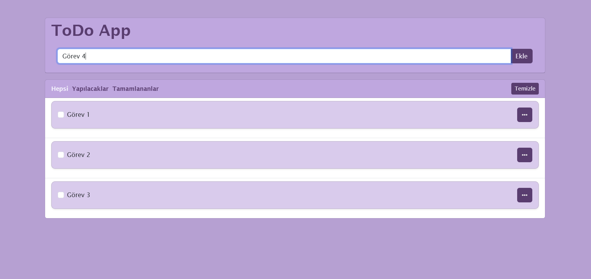
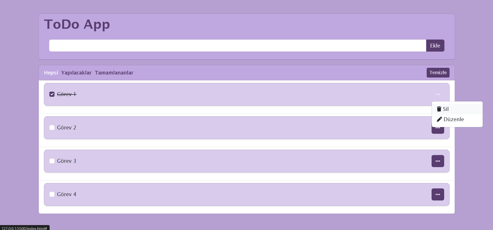
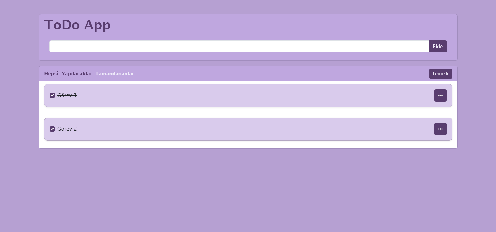
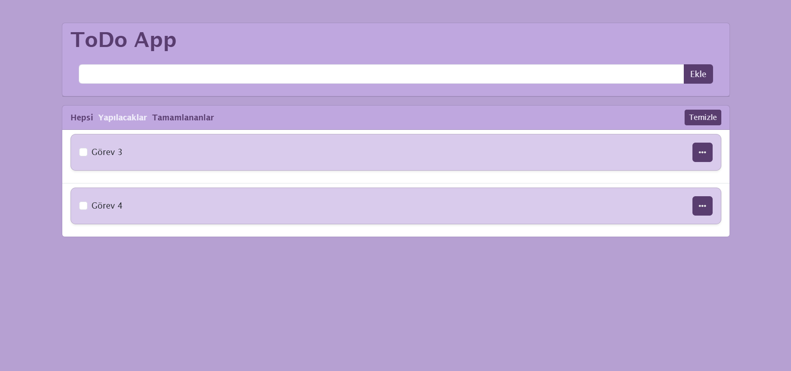
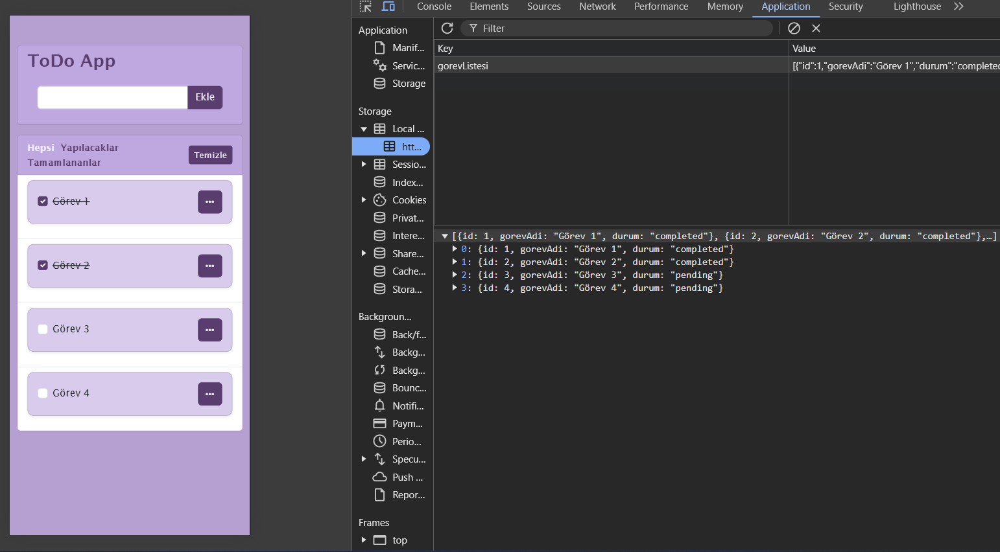

# Simple To-Do App
Günlük yapılacak işleri düzenleyebileceğiniz, ekleyebileceğiniz ve tamamlandıkça işaretleyebileceğiniz basit bir görev yönetim uygulaması

## Proje Konusu

Bu proje, kullanıcıların günlük görevlerini takip etmelerini sağlamak için geliştirilmiş basit bir **To-Do uygulamasıdır**. Kullanıcılar görevlerini ekleyebilir,eklediklerinizi güncelleyebilir, tamamlandı olarak işaretleyebilir ve silebilir.

## Neden Geliştirildi, Motivasyon

Bu uygulamayı geliştirme motivasyonum : **web geliştirme becerilerimi ve JavaScript'te yetkinliğimi artırmak** istedim.

## Hangi Sorunu Çözüyor?

Bu uygulama, kişisel verimlilik için günlük görevlerini takip etmekte zorluk çeken kişilere hitap ediyor. **Görevleri unutmak** veya **organize olmamak**, üretkenliğimizi engelleyebilir. Bu uygulama, kullanıcıların görevlerini kolayca eklemelerine, işaretlemelerine ve silmelerine olanak tanır.

## Ne Öğrendim?

Bu projeyi geliştirirken aşağıdaki konularda bilgi ve deneyim kazandım:

- **HTML, CSS, JavaScript** ile temel web geliştirme becerileri.
- **DOM manipülasyonu** ile sayfa üzerinde dinamik işlemler yapabilme.
- **Local Storage** kullanarak kullanıcı verilerini tarayıcıda saklama.
- **Bootstrap** ile tasarımı yapma.

## Ekran Görüntüleri

  
  
  
  
  
  
  
  
  

